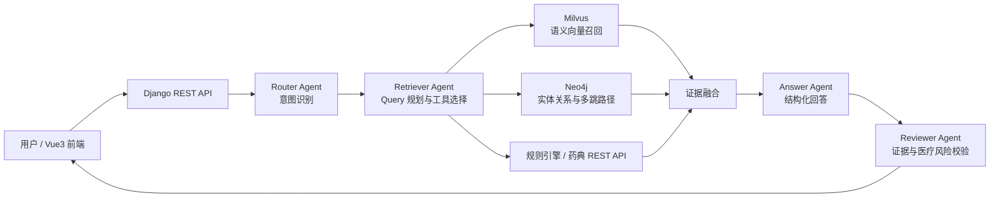
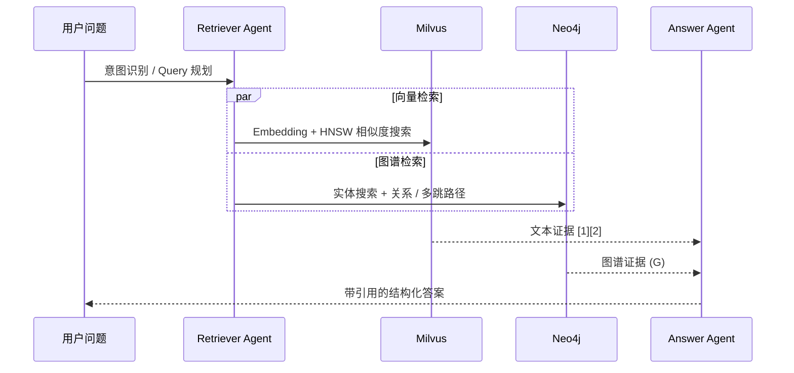

# Medical RAG Agent

> 基于 Neo4j + Milvus 的公共卫生知识图谱与医疗文档智能问答系统


## 项目简介

这是一个面向公共卫生和医疗文档场景的 RAG 问答项目，支持 PDF 文档解析、文本切分、向量化、知识图谱构建以及证据增强问答的完整链路。

项目重点解决医疗长文本中的两个问题：

- **语义检索容易丢失跨段关系**：使用 Milvus 召回语义相关文本片段。
- **实体关系和多跳逻辑难以从文本块恢复**：使用 Neo4j 存储实体、文档和关系，补充图谱证据。

模型负责理解问题、规划检索和组织答案；医疗规则、图谱和向量库负责提供可追溯证据。

## 系统架构



## 双路混合检索



- **Milvus**：保存文档 chunk 的高维向量，自动创建集合并使用 HNSW 索引；初召回候选由 Cross-Encoder 重排序。
- **Neo4j**：保存实体、文档关联、共现关系和多跳路径。
- **Retriever Agent**：根据问题意图生成检索计划。
- **Answer Agent**：融合文本证据、图谱证据和规则提示。

## 多智能体编排

| Agent | 职责 |
|---|---|
| Router | 判断事实、法规、多跳、风险等问题类型 |
| Retriever | 生成检索计划，选择向量、图谱和规则工具 |
| Answer | 融合双路证据，生成结构化中文答案 |
| Reviewer | 检查证据支撑、风险提示和不确定性 |

工具层通过统一注册表提供 Function Calling 能力：`search_vectorstore`、`search_graph`、`fetch_subgraph`、`local_rules`、`pharmacopoeia_api`。

独立工具调用使用 `asyncio.gather` 和 `asyncio.to_thread` 并发执行，适配 Neo4j、Milvus、规则引擎等同步 SDK。

### 两阶段检索与重排序

向量检索采用“粗召回 + 精排”链路：Milvus HNSW 或 FAISS 先返回候选集，再用多语种 Cross-Encoder `BAAI/bge-reranker-v2-m3` 对 `query + chunk` 成对评分，输出最终 Top K。每个证据会保存 `retrieval_rank`、`rerank_rank` 和 `rerank_score`，用于溯源与调优。首次启用会下载模型；离线或模型加载失败时，系统自动返回原始向量排序，不会中断问答。

```dotenv
RERANKER_ENABLED=1
RERANKER_MODEL_NAME=BAAI/bge-reranker-v2-m3
RERANKER_CANDIDATE_K=20
RERANKER_BATCH_SIZE=8
```

部署或镜像构建阶段可提前执行模型预热，避免首个问答请求承担下载耗时：

```cmd
python manage.py preload_reranker
```

### Router 路由治理

Router 仅负责返回意图与置信度，是否调用图谱、规则引擎及是否需要人工复核由后端策略表统一决定，模型输出不能直接提升工具权限。路由请求会进行长度和空值校验，记录不含用户原文的 `trace_id`、耗时与降级原因；模型不可用或返回非法 JSON 时，会按风险/法规关键词走保守降级策略。

Retriever 只能在 Router 下发的白名单内规划工具，后端会覆盖模型给出的 `question`、`document_ids`、`top_k` 等受控参数。工具执行采用 `asyncio.to_thread`、信号量并发限流和单工具超时；某条检索通路失败只会返回该通路错误，不会取消其余证据召回。测试使用 `pytest`，可执行 `python -m pytest -q`。

### 会话记忆与流式回答

问答页实现了类似 Claude Code 的**上下文压缩**，但不会把完整历史反复塞给模型：

| 层级 | 存储内容 | 行为 |
|---|---|---|
| 短期记忆 | 当前会话最近消息 | 保留原文，保证连续追问的上下文 |
| 滚动摘要 | 超出短期窗口的旧消息 | 由 Reviewer 模型压缩为主题、约束、未解决事项和风险提示 |
| 长期记忆 | 研究主题和已答复摘要 | 按浏览器 `memory_scope_id` 隔离，按中文关键词召回，可随时清除 |

前端使用 `POST /api/qa/ask/stream/` 消费 SSE：`progress` 事件展示 `memory → router → retriever → tools → answer → reviewer` 的可审计轨迹，`token` 事件逐片段显示回答，`complete` 返回已审查的最终答案与证据。这里展示的是可核验执行状态，**不展示模型原始隐式思维链**。普通兼容接口仍为 `POST /api/qa/ask/`。

```dotenv
MEMORY_ENABLED=1
MEMORY_SHORT_TERM_MESSAGE_LIMIT=8
MEMORY_SUMMARY_MAX_CHARS=1200
MEMORY_CONTEXT_MAX_CHARS=3000
MEMORY_LONG_TERM_TOP_K=3
```

记忆管理接口：`GET /api/qa/memory/overview/?memory_scope_id=<uuid>` 与 `POST /api/qa/memory/clear/`（请求体为 `{"memory_scope_id":"<uuid>"}`）。医疗对话可能包含敏感内容，生产部署应使用受控 PostgreSQL、加密与访问审计，并结合数据保留策略配置清除周期。

### MCP 联网检索

项目提供 `mcp/medical_search_server.py`（Python MCP SDK、stdio 模式），对外暴露 `web_search(query, max_results)`；Django 内部 Agent 使用同一实现，因此不是只写文档的 MCP 空壳。法规路由可规划 `web_search`，结果以 `(W1)` 等外部证据标识传给 Answer Agent，并保留标题、URL、域名和摘要。公开网页是不可信输入，医疗风险和法规结论须核验官方原文。

复制 `mcp/codex.mcp.toml.example` 中的配置到 Codex MCP 配置后，重启客户端即可使用；项目 Skill 位于 `.codex/skills/medical-web-research/`。可通过 `WEB_SEARCH_ENABLED=0` 禁用联网检索。

### 可观测性：LangSmith + Prometheus + Grafana

后端会将 HTTP、问答流水线、Agent、工具调用和重排序指标暴露到 `/metrics`；Docker Compose 中的 Prometheus 每 15 秒抓取一次，Grafana 会自动载入 `Medical RAG Agent Overview` 看板。前端侧边栏的“监控”页会展示 LangSmith 配置状态、近期任务、指标入口和 Prometheus/Grafana 跳转链接。

```cmd
docker compose up -d --build
```

启动后访问：

- 应用监控页：`http://localhost/observability`
- Prometheus：`http://localhost:9090`
- Grafana：`http://localhost:3000`（账号密码读取 `GRAFANA_ADMIN_USER` / `GRAFANA_ADMIN_PASSWORD`）
- 原始指标：`http://localhost/metrics`

启用 LangSmith 时在 `.env` 填入真实凭证并重启后端：

```dotenv
LANGSMITH_TRACING=1
LANGSMITH_API_KEY=lsv2_pt_xxx
LANGSMITH_PROJECT=medical-rag-agent
LANGSMITH_DASHBOARD_URL=https://smith.langchain.com/
```

项目默认附带 HTTP 5xx、问答 P95 延迟和重排序失败三条 Prometheus 告警规则；生产环境可在 `monitoring/prometheus/alerts.yml` 对接 Alertmanager、企业微信、钉钉或 PagerDuty。

## 文档处理链路

```text
PDF 上传 → 文本解析 / OCR → Recursive Chunking
      → Embedding → Milvus 入库
      → 实体抽取 → Neo4j 建图
      → Router / Retriever → 双路召回 → Answer / Reviewer
```

## 技术栈

| 层次 | 技术 |
|---|---|
| 后端 | Django、Django REST Framework、Gunicorn |
| 前端 | Vue3、Vite、Nginx |
| 大模型 | Ollama 本地模型，可配置 Qwen / DeepSeek；支持外部 LLM 网关 |
| 向量检索 | Milvus、HNSW、Sentence Transformers、Cross-Encoder Reranker |
| 图谱检索 | Neo4j、Cypher、GraphRAG |
| Agent | Router、Retriever、Answer、Reviewer、Function Calling |
| 基础设施 | Docker Compose |
| 自动化 | GitHub Actions |

## 快速启动：本地 Python

Windows `cmd`：

```cmd
cd /d C:\1\工作\练手\20261\20261
copy .env.example .env
python -m pip install -r requirements.txt
python manage.py migrate
python manage.py check
python manage.py runserver 0.0.0.0:8000
```

API 文档：

- Swagger UI：`http://127.0.0.1:8000/api/docs/`
- OpenAPI Schema：`http://127.0.0.1:8000/api/schema/`

## 核心流程

1) 上传 PDF：`POST /api/documents/`
2) 解析与切分：`POST /api/documents/{id}/parse/`
3) 向量化入库：`POST /api/qa/embed/{document_id}/`
4) 提问：`POST /api/qa/ask/`
5) 流式提问：`POST /api/qa/ask/stream/`

## 阿里云 ECS 自动部署

主分支推送后，GitHub Actions 会先执行 Django 测试与 Vue 构建，再通过 SSH 将发布包传到 ECS，使用 `docker-compose.aliyun.yml` 构建并更新服务。发布采用独立版本镜像与健康检查，失败时自动恢复上一版本。

1. 立即撤销任何曾公开粘贴或提交过的 SSH 私钥，重新生成专用部署密钥，并只把公钥加入服务器 `authorized_keys`。
2. 首次在 ECS 上以管理员身份运行 `sudo bash scripts/bootstrap_aliyun.sh <部署用户名>`，安装 Docker 与 Compose 插件并创建 `/opt/medical-rag`。
3. 复制 `.env.aliyun.example`，替换其中所有 `replace-with-...` 值，将完整内容保存为 GitHub Environment `production` 的 Secret：`ALIYUN_DEPLOY_ENV_FILE`。
4. 在 GitHub Environment `production` 添加 Secret：`ALIYUN_SSH_PRIVATE_KEY`、`ALIYUN_SSH_KNOWN_HOSTS`。
5. 按需添加 Variables：`ALIYUN_HOST`（默认 `121.41.73.242`）、`ALIYUN_USER`（默认 `root`）、`ALIYUN_SSH_PORT`（默认 `22`）、`ALIYUN_DEPLOY_PATH`（默认 `/opt/medical-rag`）。
6. 阿里云安全组仅开放部署机所需的 SSH 端口，并开放业务端口 `80`；生产环境建议配置域名、HTTPS 与最小来源范围。

服务器主机公钥必须从可信控制台核验后写入 `ALIYUN_SSH_KNOWN_HOSTS`，不要在 CI 中使用跳过主机校验的参数。联网搜索由 Django Agent 与 `mcp/medical_search_server.py` 共用实现，生产环境通过 `WEB_SEARCH_ENABLED=1` 启用。

Milvus 默认是向量后端，集合首次向量化时自动创建并使用 HNSW；本地开发时可将 `VECTOR_BACKEND=faiss`，或保留 `MILVUS_FALLBACK_TO_FAISS=1` 作为离线兜底。

MAS 中 Router/Retriever 先完成规划，随后工具执行阶段通过 `asyncio.gather` + `asyncio.to_thread` 并发调用独立的 Milvus、Neo4j、规则引擎和外部 API，最后由 Answer/Reviewer 汇总校验。

## 目录结构

```text
.
├── documents/                PDF 文档、解析与 chunk 模型
├── qa/                       问答服务、Milvus 检索与 Agent 编排
├── kg/                       Neo4j 图谱构建与查询
├── monitoring/               任务状态和日志
├── frontend/                 Vue3 前端
├── Milvus/                   Milvus 使用说明
├── scripts/                  本地 Smoke Test 与部署脚本
├── Dockerfile                后端镜像
├── docker-compose.yml        本地完整服务栈
└── .github/workflows/        CI/CD 流水线
```

## License

本项目可用于学习、作品集和技术面试展示。医疗场景输出仅供研究和辅助参考。