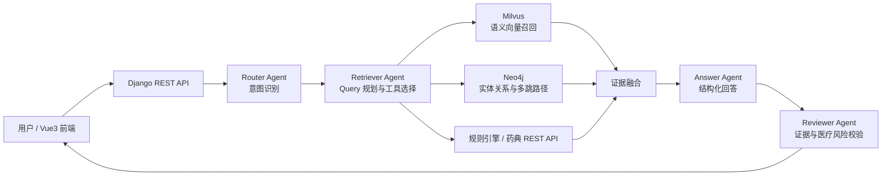
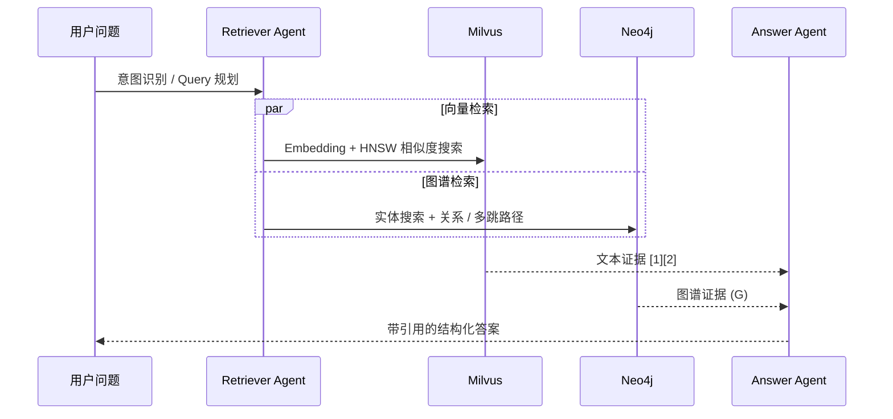

# Medical RAG Agent

> 基于 Neo4j + Milvus 的公共卫生知识图谱与医疗文档智能问答系统


## 项目简介

这是一个面向公共卫生和医疗文档场景的 RAG 问答项目，支持 PDF 文档解析、文本切分、向量化、知识图谱构建以及证据增强问答的完整链路。

项目重点解决医疗长文本中的两个问题：

- **语义检索容易丢失跨段关系**：使用 Milvus 召回语义相关文本片段。
- **实体关系和多跳逻辑难以从文本块恢复**：使用 Neo4j 存储实体、文档和关系，补充图谱证据。

模型负责理解问题、规划检索和组织答案；医疗规则、图谱和向量库负责提供可追溯证据。

## 系统架构



## 双路混合检索



- **Milvus**：保存文档 chunk 的高维向量，自动创建集合并使用 HNSW 索引。
- **Neo4j**：保存实体、文档关联、共现关系和多跳路径。
- **Retriever Agent**：根据问题意图生成检索计划。
- **Answer Agent**：融合文本证据、图谱证据和规则提示。

## 多智能体编排

| Agent | 职责 |
|---|---|
| Router | 判断事实、法规、多跳、风险等问题类型 |
| Retriever | 生成检索计划，选择向量、图谱和规则工具 |
| Answer | 融合双路证据，生成结构化中文答案 |
| Reviewer | 检查证据支撑、风险提示和不确定性 |

工具层通过统一注册表提供 Function Calling 能力：`search_vectorstore`、`search_graph`、`fetch_subgraph`、`local_rules`、`pharmacopoeia_api`。

独立工具调用使用 `asyncio.gather` 和 `asyncio.to_thread` 并发执行，适配 Neo4j、Milvus、规则引擎等同步 SDK。

## 文档处理链路

```text
PDF 上传 → 文本解析 / OCR → Recursive Chunking
      → Embedding → Milvus 入库
      → 实体抽取 → Neo4j 建图
      → Router / Retriever → 双路召回 → Answer / Reviewer
```

## 技术栈

| 层次 | 技术 |
|---|---|
| 后端 | Django、Django REST Framework、Gunicorn |
| 前端 | Vue3、Vite、Nginx |
| 大模型 | Ollama 本地模型，可配置 Qwen / DeepSeek；支持外部 LLM 网关 |
| 向量检索 | Milvus、HNSW、Sentence Transformers |
| 图谱检索 | Neo4j、Cypher、GraphRAG |
| Agent | Router、Retriever、Answer、Reviewer、Function Calling |
| 基础设施 | Docker Compose、Terraform、AWS ECS Fargate、ALB、ECR |
| 自动化 | GitHub Actions、AWS OIDC、CloudWatch Logs |

## 快速启动：本地 Python

Windows `cmd`：

```cmd
cd /d C:\1\工作\练手\20261\20261
copy .env.example .env
python -m pip install -r requirements.txt
python manage.py migrate
python manage.py check
python manage.py runserver 0.0.0.0:8000
```

API 文档：

- Swagger UI：`http://127.0.0.1:8000/api/docs/`
- OpenAPI Schema：`http://127.0.0.1:8000/api/schema/`

## 核心流程

1) 上传 PDF：`POST /api/documents/`
2) 解析与切分：`POST /api/documents/{id}/parse/`
3) 向量化入库：`POST /api/qa/embed/{document_id}/`
4) 提问：`POST /api/qa/ask/`

更多说明见 [backend_api.md](docs/backend_api.md)。Milvus 默认是向量后端，集合首次向量化时自动创建并使用 HNSW；本地开发时可将 `VECTOR_BACKEND=faiss`，或保留 `MILVUS_FALLBACK_TO_FAISS=1` 作为离线兜底。

MAS 中 Router/Retriever 先完成规划，随后工具执行阶段通过 `asyncio.gather` + `asyncio.to_thread` 并发调用独立的 Milvus、Neo4j、规则引擎和外部 API，最后由 Answer/Reviewer 汇总校验。

## 目录结构

```text
.
├── documents/                PDF 文档、解析与 chunk 模型
├── qa/                       问答服务、Milvus 检索与 Agent 编排
├── kg/                       Neo4j 图谱构建与查询
├── monitoring/               任务状态和日志
├── frontend/                 Vue3 前端
├── Milvus/                   Milvus 使用说明
├── infra/                    AWS Terraform 基础设施
├── scripts/                  本地 Smoke Test 与部署脚本
├── Dockerfile                后端镜像
├── docker-compose.yml        本地完整服务栈
└── .github/workflows/        CI/CD 流水线
```

## License

本项目可用于学习、作品集和技术面试展示。医疗场景输出仅供研究和辅助参考。
